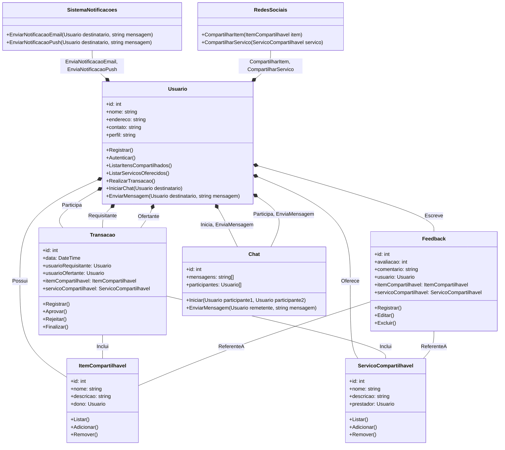

## ComUniShare

Projeto do grupo 10 

[link da aplicação](https://com-uni-share-odv18nr29-pedromotta462.vercel.app/)

## Screenshots

## Diagrama de Classes

##

## References

[NextJS] [https://nextjs.org/]

[ShadcnUI] [https://ui.shadcn.com/]

[TailwindCSS] [https://tailwindcss.com/]
